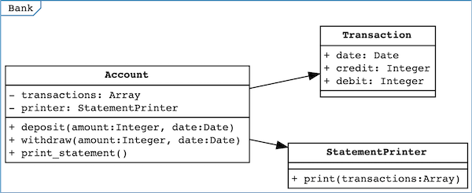
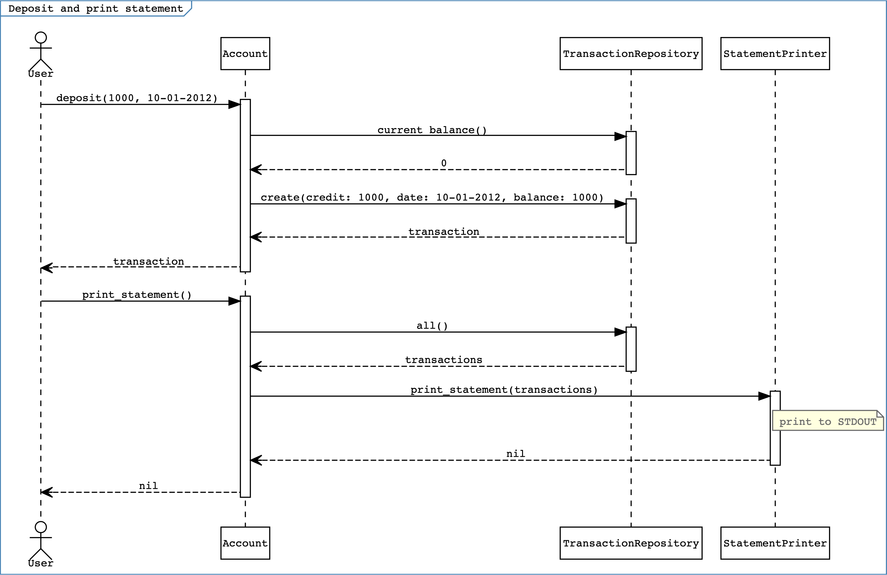

# Bank

This is an exercise in Ruby to practice object-oriented design and test-driven development skills.

## Specification

### Requirements

* You should be able to interact with your code via a REPL like IRB or the JavaScript console.  (You don't need to implement a command line interface that takes input from STDIN.)
* Deposits, withdrawal.
* Account statement (date, amount, balance) printing.
* Data can be kept in memory (it doesn't need to be stored to a database or anything).

### Acceptance criteria

- **Given** a client makes a deposit of 1000 on 10-01-2012
- **And** a deposit of 2000 on 13-01-2012
- **And** a withdrawal of 500 on 14-01-2012
- **When** she prints her bank statement
- **Then** she would see
    ```
    date || credit || debit || balance
    14/01/2012 || || 500.00 || 2500.00
    13/01/2012 || 2000.00 || || 3000.00
    10/01/2012 || 1000.00 || || 1000.00
    ```

---

## Pre-requisites

- Ruby 2.7.0
- Bundler 2

## Get started

1. Clone this repository
1. Install dependencies
    ```bash
    bundle install
    ```
1. Run the Ruby linter
    ```bash
    bundle exec rubocop
    ```
1. Run the tests and check coverage
    ```bash
    bundle exec rspec
    ```

## Usage

Here is an example of how to use the bank account in `irb`:

```ruby
$ irb
irb(main):001:0> require "date"
=> true
irb(main):002:0> require_relative "lib/account"
=> true
irb(main):003:0> account = Account.new
irb(main):004:0> account.deposit(1000, Date.new(2012, 1, 10))
=> #<Transaction:0x00007f85fc84d580 @date=#<Date: 2012-01-10 ((2455937j,0s,0n),+0s,2299161j)>, @credit=1000, @debit=0, @balance=1000>
irb(main):005:0> account.deposit(2000, Date.new(2012, 1, 13))
=> #<Transaction:0x00007f85fc3aba40 @date=#<Date: 2012-01-13 ((2455940j,0s,0n),+0s,2299161j)>, @credit=2000, @debit=0, @balance=3000>
irb(main):006:0> account.withdraw(500, Date.new(2012, 1, 14))
=> #<Transaction:0x00007f85fc2eeb70 @date=#<Date: 2012-01-14 ((2455941j,0s,0n),+0s,2299161j)>, @credit=0, @debit=500, @balance=2500>
irb(main):007:0> account.print_statement
date || credit || debit || balance
14/01/2012 || || 500.00 || 2500.00
13/01/2012 || 2000.00 || || 3000.00
10/01/2012 || 1000.00 || || 1000.00
=> nil
```

## Feature test

The [bank account feature test](./spec/features/bank_account_spec.rb) satisfies the acceptance criteria.

## Domain model

### Objects

A class diagram was drawn to model the objects in the domain using [DotUML Playground](https://dotuml.com/playground.html).



- `Account` provides the public interface for deposit, withdrawl and printing the statment.
- `TransactionRepository` stores transactions in memory.
- `Transaction` is a read-only data object that represents one transaction.
- `StatementPrinter` formats and prints a list of transactions.

### Interactions

This sequence diagram shows the interactions to make a deposit and print the statement.


